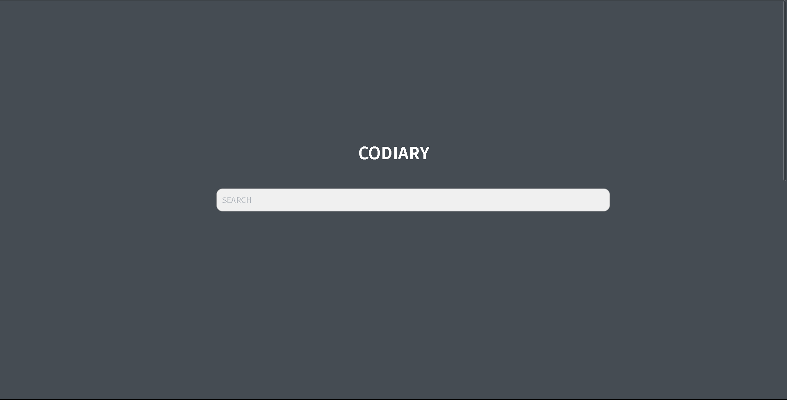
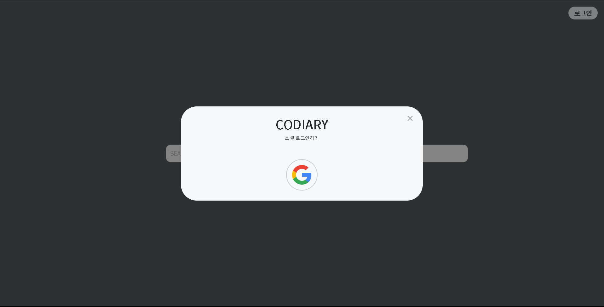
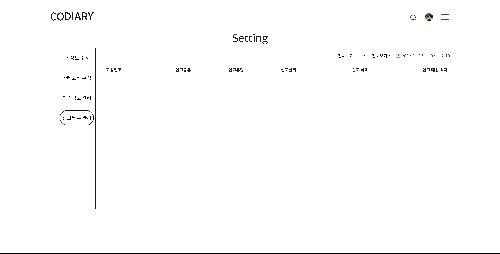

# codiary
# 프로젝트 목적
- 마크다운 파일을 통해 깔끔히 정리된 페이지를 보여주며, 공부한 내용들을 저장 할 수 있는 공대생들을 위한 감각적인 블로그 제작

# 기술 스택 및 구조
- 

# 개발 환경
- 언어: javaScraipt
- 서버: nginX
- 프레임 워크: Express, node, react, sequelize
- 데이터베이스: mySql
- IDE: VS Code, dbeaver, postman
# 역할
## 강경민
- api 구현
- DB 설계
  - 트리거, 스케쥴러 활용
- 구글 로그인
- Cors문제 해결
- 입력값 검증 구현
- 유저 검증 구현
- 이미지 서버 구현
- 에러 핸들러 구현
- Redux활용해 프론트 로그인 기능 구현
- Axios로 백 프론트 연결
## 임효현
- UI/UX 디자인
- 웹 퍼블리싱
- Front - end

# Attachment
- git: https://github.com/jamin12/codiary.git
- document: https://drive.google.com/drive/folders/1M_GNGTRyXHKgQmJNv42sGNakM499NKrs?usp=sharing
- web: https://www.codiary.shop
# 데이터 베이스
- 
# flow chart
- 
# IA 설계
- 
# WBS
- 

# 화면정의
## 홈화면 페이지
- 
- 
## 로그인 페이지
- 
## 검색 페이지
- 
## 게시글 작성 페이지
- 
- 
## 날짜 별 게시글 조회 페이지
- 
## 카테고리 별 게시글 조회 페이지
- 

## 게시글 페이지
- 
- 
## 임시저장 글 페이지
- 
## 방문 좋아요 목록 페이지
- 
## 통계 페이지
- 
- 
## 개인정보 수정 페이지
- 
- 
## 카테고리 수정 페이지
- 
## 유저관리 페이지
- 
## 신고관리 페이지
- 